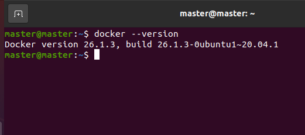
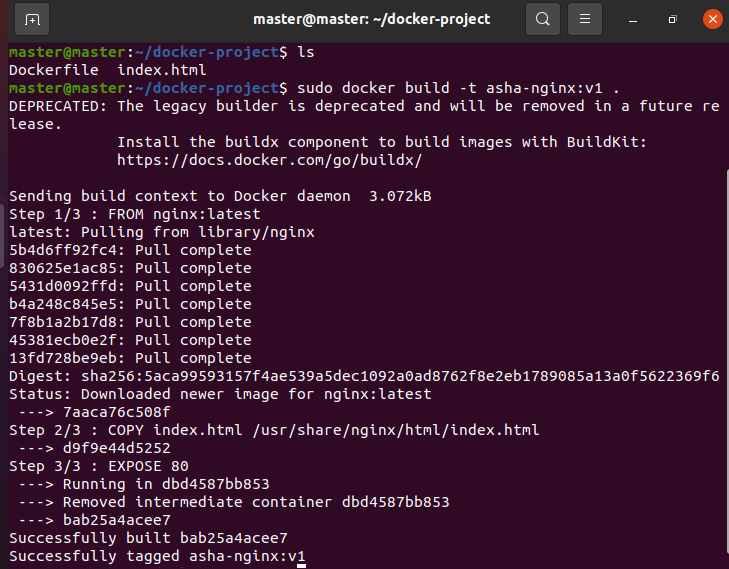
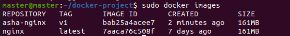
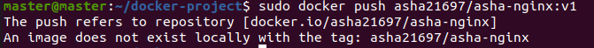
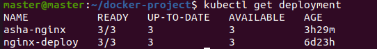
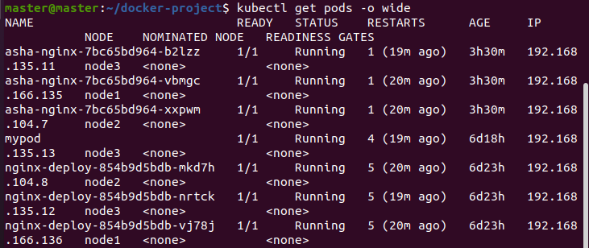
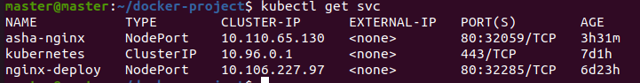
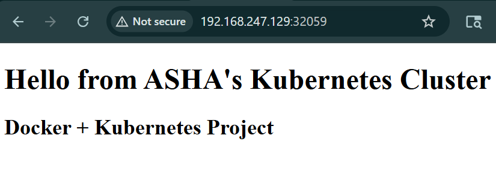
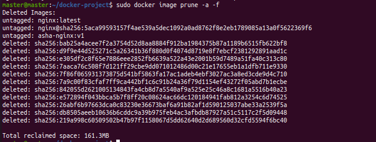

# Docker & Kubernetes Nginx Deployment

## Overview

This project demonstrates the complete deployment lifecycle of a containerized web application using Docker and Kubernetes.

A custom Nginx web page was created using HTML, packaged into a Docker image, pushed to Docker Hub, and deployed on a Kubernetes cluster using Deployments and NodePort Services.

## Architecture

HTML Application
↓
Dockerfile
↓
Docker Image
↓
Docker Container
↓
Docker Hub
↓
Kubernetes Deployment
↓
Kubernetes Service (NodePort)
↓
Browser Access

## Technologies Used

- Docker
- Kubernetes
- Nginx
- Docker Hub
- Linux

## Project Implementation

### Step 1: Created Custom Web Page

Created a custom HTML page:

```text
index.html
```

### Step 2: Created Dockerfile

```dockerfile
FROM nginx:latest
COPY index.html /usr/share/nginx/html/index.html
EXPOSE 80
```

### Step 3: Built Docker Image

```bash
docker build -t asha-nginx:v1 .
```

### Step 4: Ran Docker Container

```bash
docker run -d -p 8080:80 --name asha-web asha-nginx:v1
```

### Step 5: Published Image to Docker Hub

```bash
docker tag asha-nginx:v1 asha21697/asha-nginx:v1

docker push asha21697/asha-nginx:v1
```

### Step 6: Deployed on Kubernetes

```bash
kubectl create deployment asha-nginx \
--image=asha21697/asha-nginx:v1 \
--replicas=3
```

### Step 7: Exposed Application

```bash
kubectl expose deployment asha-nginx \
--type=NodePort \
--port=80
```

### Step 8: Verified Application

Verified:

- Running Pods
- Kubernetes Service
- Browser Accessibility
- End-to-End Deployment

## Skills Demonstrated

- Docker Installation & Administration
- Docker Image Creation
- Dockerfile Development
- Container Management
- Docker Hub Integration
- Kubernetes Deployments
- Kubernetes Services
- NodePort Networking
- Linux Administration
- Containerized Application Deployment

## Project Outcomes

- Successfully containerized a custom web application.
- Built and managed Docker images and containers.
- Published Docker images to Docker Hub.
- Deployed a containerized application on Kubernetes.
- Exposed services using NodePort.
- Verified application accessibility through a web browser.

## Screenshots

### Docker Version


### Docker Image Build


### Docker Images


### Docker Hub Push


### Kubernetes Deployment


### Kubernetes Pods


### Kubernetes Service


### Application Output


### Docker Cleanup


## Author

Asha Kamal
### Build Image

```bash
